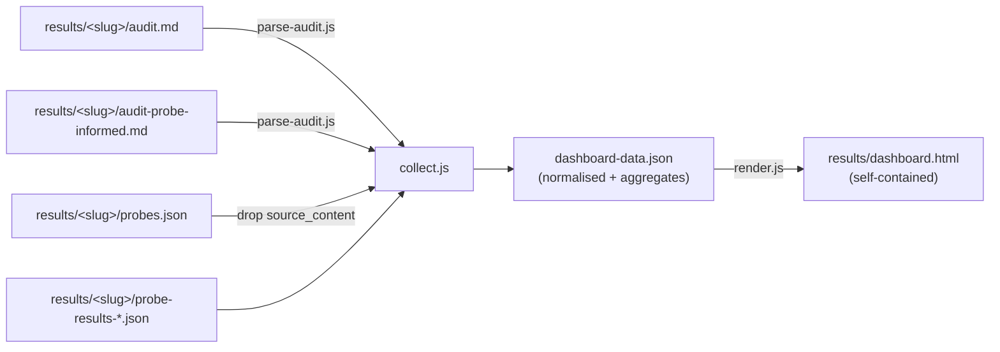

# feat: GEO results dashboard — static, stats-driven report for third parties

**Type:** enhancement
**Created:** 2026-07-28
**Status:** planned

## Overview

Build `geo-audit dashboard` — a subcommand that reads everything under `results/` and emits a
single self-contained HTML file summarising every audited page: GEO scores, answer fidelity,
retrieval performance, hallucination taxonomy, and prioritized fixes.

The audience is a third party (a docs team lead, a stakeholder deciding where to spend effort)
who did not run the tool and will not read six Markdown files or a 132 KB JSON blob. They need
to arrive at a defensible conclusion in about two minutes.

## Problem statement

The pipeline already produces good data, but it is **unreadable in aggregate**:

| Artifact | Format | Problem for a reader |
|---|---|---|
| `results/<slug>/audit.md` | prose Markdown | Scores live inside a Markdown table; no cross-page comparison possible |
| `results/<slug>/probes.json` | JSON | Dominated by `source_content` — a full page snapshot nobody wants to read |
| `results/<slug>/probe-results-*.json` | JSON | 88–132 KB; every model answer is ~3 KB of prose |

Consequences today:

1. **No corpus view.** Four pages are audited; comparing them means opening four files and
   hand-transcribing a table.
2. **The most valuable finding is invisible.** The tool measures both how good a page *looks*
   (GEO score) and how well models actually *answer* from it (fidelity). The gap between those
   two numbers is the entire point of the tool, and nothing surfaces it.
3. **Aggregates are computed nowhere.** Hallucination types, per-archetype failure rates, and
   hit-vs-miss fidelity are only derivable with an ad-hoc script.

### The headline stat, computed from current `results/`

Across the 20 probes that have been run (2 pages × 10):

| Cohort | n | Avg fidelity |
|---|:--:|:--:|
| Source **was** cited (retrieval hit) | 5 | **77.6** |
| Source **not** cited (retrieval miss) | 15 | **52.7** |

**A retrieval hit is worth ~25 fidelity points.** Retrieval — not prose quality — is the
dominant lever, and the current per-page reports never say so. The dashboard's job is to make
that conclusion unavoidable.

## Proposed solution

A **build-time collector** walks `results/`, normalises every artifact into one
`dashboard-data.json`, and renders a **single static HTML file** with inlined data, CSS, and JS.



### Key decision 1 — parse the Markdown, do not re-run the audits

`audit.md` is prose, but it is **prompt-mandated prose**. `prompts/geo-audit.md:132` says
"return exactly this Markdown, nothing else" and pins the exact template. Verified empirically
across all six audit files in `results/`:

- `## GEO Score: {n}/100 — {band}` is on **line 7 of every file**
- The 9-row dimension table ends with `| **Total** |` on **line 20 of every file**
- `## Summary` line 22, `## Dimension analysis` line 26, `## Prioritized recommendations` line 38

A regex/line parser is therefore reliable. The alternative — adding a JSON schema to the
`score` command — would mean **re-running every audit** (minutes of Opus time each, and the
existing reports would be orphaned). Rejected as expensive and lossy.

Hedge: emit a structured JSON artifact *going forward* as a later phase (see Phase 4), so the
parser eventually becomes a back-compat path rather than the only path.

### Key decision 2 — zero new dependencies, single HTML file

The repo is plain Node ESM with four dependencies and no build tooling (`package.json:15-20`).
Adding React/Vite/Tailwind to render nine bar charts would dwarf the tool it documents, and the
brief is explicitly "very minimal, nothing fancy."

- Bars are `<div>`s with a percentage width. No charting library.
- Tabs are ~30 lines of vanilla JS toggling `hidden`.
- Data is inlined as a `<script type="application/json">` block.

The output is one file you can email, drop in S3, or open with `file://` — which is exactly what
"third parties looking at it" requires. No server, no install.

### Key decision 3 — the corpus view is the landing page

Per-page detail already exists as Markdown. What does not exist is the comparison. The default
view is the corpus; a page detail is one click in.

## Information architecture

Four top-level pages. Tabs only *within* page detail, where the content is genuinely parallel.

### Page 1 — Overview (landing)

- **Four KPI tiles:** pages audited · median GEO score · median answer fidelity · retrieval hit
  rate
- **The Gap chart** (the centrepiece): one row per page, two paired bars — GEO score vs probe
  fidelity — sorted by gap size. A page scoring 77 that answers at 62 is the story.
- **Corpus table:** page · score + band · fidelity · hit rate · P1 count · probe status.
  Sortable. Click-through to detail.
- **Weakest dimensions across the corpus:** the 9 rubric dimensions ranked by mean score, so a
  reader sees which problem is systemic rather than per-page.

Pages without a probe run show "—", never a zero. Absence of data must not read as bad data.

### Page 2 — Page detail (tabbed)

| Tab | Content | Source |
|---|---|---|
| **Scorecard** | 9 dimension bars with weight + weighted contribution, band, summary prose, per-dimension analysis | `audit.md` |
| **Recommendations** | P1/P2/P3 cards (or Tier 1–4 when probe-informed) with Where / Issue / Change / Why | `audit.md` |
| **Probes** | Table: id · archetype · fidelity · hit/miss · hallucination count. Row expands to prompt, verdict, hallucinations, missing must-include | `probe-results-*.json` |
| **Anti-patterns** | Anti-patterns found + off-page notes | `audit.md` |

### Page 3 — Answer quality (cross-page)

The aggregate analysis that exists nowhere today. All figures below are real, computed from
current `results/`:

- **Retrieval impact:** hit 77.6 vs miss 52.7 fidelity (n=5 / n=15)
- **Hallucination taxonomy:** 43 hallucinations across 20 probes; 15 of 20 probes contained at
  least one. By type — `other` 25, `contradiction` 9, `fabricated_function` 6,
  `invented_param` 2, `wrong_import` 1. By severity — high 17, med 15, low 11.
- **Failure by question phrasing** (the actionable one — tells you what content to write):

  | Archetype | n | Avg fidelity | Hit rate |
  |---|:--:|:--:|:--:|
  | code-first | 2 | 36.5 | 0% |
  | verbose/beginner | 2 | 45.5 | 0% |
  | direct-howto | 5 | 51.2 | 40% |
  | error-debug | 2 | 54.0 | 0% |
  | comparison | 2 | 67.5 | 0% |
  | constrained | 3 | 69.3 | 33% |
  | paraphrase | 2 | 75.0 | 50% |
  | terse/keyword | 2 | 79.0 | 50% |

- **Retrieval funnel:** searches attempted → returned results → cited the source → answered
  accurately. Degrades gracefully where the older runs lack the counters (see Risks).

### Page 4 — Methodology

Non-negotiable for third-party credibility. Without it the numbers are unfalsifiable.

- The 9 rubric dimensions and weights (from `prompts/geo-audit.md:114-124`)
- Score bands: 0–39 Poor · 40–59 Developing · 60–74 Good · 75–89 Strong · 90–100 Exemplary
  (`prompts/geo-audit.md:126`)
- What fidelity means and that grading is LLM-judged against the page as sole ground truth
- Models used, run timestamps, probe counts per page
- **Honest caveats**, stated plainly — see below

## Data caveats the dashboard must handle (all verified in current `results/`)

These are real properties of the existing files, not hypotheticals. Each needs explicit
handling or the dashboard will mislead.

1. **Schema drift between probe runs.** `concepts-non-determinism-go/probe-results-opus-4-8-web.json`
   (run 2026-07-15) has **no** `live_search_failed_count`, no `inconclusive_miss_count`, and its
   per-probe `harness` lacks `searches_attempted` / `searches_succeeded` / `live_search_failed`.
   The newer `workflow-using-randomness` run (2026-07-28) has all of them. → Treat missing as
   **unknown, not zero**; render "—" and exclude from funnel denominators.

2. **Superseded artifacts.** `concepts-non-determinism-go/` contains `audit-old.md` and
   `probes-old.json`. → Exclude any `*-old.*` file by glob.

3. **Three different scores for one page.** That same slug has `audit-old.md` = 81,
   `audit.md` = 71, `audit-probe-informed.md` = 75. This is LLM-judge run-to-run variance and
   it must be disclosed on the Methodology page, not hidden. → Precedence:
   `audit-probe-informed.md` supersedes `audit.md` for headline figures; show the delta as a
   "re-scored with probe evidence: 71 → 75" note on the page detail.

4. **Partial coverage is the norm.** Of four audited pages, two have probe runs and one has a
   probe-informed re-score. `price-feeds-addresses` has only `audit.md` (and scored 37/100 —
   Poor). → Every aggregate needs an explicit denominator ("fidelity across 2 of 4 pages").

5. **Tiny n.** 20 probes total. → Show n beside every average. No trend lines, no
   significance claims.

6. **Never inline secrets.** The collector reads only `results/`. `.env` is gitignored
   (`.gitignore` line "dotenv environment variable files") and must never be read or embedded.

## Data omitted deliberately

The brief says omit what is not required. Explicitly dropped from `dashboard-data.json`:

- `probes.json.source_content` — a full page snapshot, the single largest field, of no value to a reader
- `answer_key` internals (`must_include`, `correct_entities`, `common_hallucinations`, `out_of_scope`) — the grader already reduced these to `missing_must_include`
- Full model `answer` text (~3 KB × 20) — kept out of the main flow, available behind a
  `<details>` disclosure on the probe row only
- `unverifiable_from_source` — surfaced as a count, expandable
- Duplicated `publisher`/`author` org blocks and other JSON-LD boilerplate

Target: keep `dashboard.html` under ~500 KB with all four current pages included.

## Technical approach

### New files

```
src/dashboard/parse-audit.js   audit.md -> structured object
src/dashboard/collect.js       walk results/, join by slug, compute aggregates
src/dashboard/render.js        data -> HTML string (template literals)
src/dashboard/theme.js         CSS + client JS as exported strings
test/parse-audit.test.js       node --test, runs against the 6 real audit files
```

Modified: `src/cli.js` — register the `dashboard` subcommand and add it to `USAGE`.

### `src/dashboard/parse-audit.js`

```js
// Parses the prompt-mandated template in prompts/geo-audit.md:137-205.
// Throws on structural mismatch rather than returning partial data — a silently
// half-parsed audit would render as a misleading zero.
export function parseAudit(markdown) {
  return {
    title,            // "# GEO Audit — {title}"
    url,              // "**URL:** ..."
    analyzedAt,       // "**Analyzed:** {ISO}"
    contentType,      // "**Content type:** ..."
    score,            // 75  <- "## GEO Score: 75/100 — Strong"
    band,             // "Strong"
    weightedTotal,    // 74.7 <- "| **Total** | **100** | | **74.7** |"
    dimensions: [{ name, weight, score, weighted }],  // exactly 9
    summary,          // prose
    probeInformed,    // { scoreVsFidelity, retrievalTable, missTriage, ... } | null
    dimensionAnalysis: [{ dimension, text }],
    recommendations: [{ priority, tier, title, mapsTo, where, issue, change, why }],
    antiPatterns: [],
    offPageNotes: [],
  };
}
```

Parser contract: assert exactly 9 dimension rows and that weights sum to 100. If the template
ever drifts, fail loudly with the offending slug.

### `src/dashboard/collect.js`

```js
// One record per slug; aggregates computed once, not in the browser.
export function collect(resultsDir) {
  return {
    generatedAt,
    pages: [{
      slug, title, url, contentType,
      audit,                 // parseAudit(audit-probe-informed.md ?? audit.md)
      auditVariants: [{ file, score }],   // discloses re-score variance
      probeRuns: [{ model, mode, runAt, avgFidelity, hitRate, hitRateEffective,
                    probes: [{ id, archetype, fidelity, scores, hit, citedUrls,
                               hallucinations, missingMustInclude, verdict, answer }] }],
    }],
    aggregates: {
      pageCount, probedPageCount, probeCount,
      medianScore, medianFidelity, hitRate,
      fidelityByRetrieval: { hit: {n, avg}, miss: {n, avg} },
      dimensionMeans: [{ name, weight, mean, n }],
      hallucinationsByType, hallucinationsBySeverity,
      byArchetype: [{ archetype, n, avgFidelity, hitRate }],
      coverageNotes: [],     // "2 of 4 pages have probe runs"
    },
  };
}
```

### CLI surface

```sh
node src/cli.js dashboard                      # -> results/dashboard.html
node src/cli.js dashboard -o report.html       # custom path
node src/cli.js dashboard --json               # also write results/dashboard-data.json
node src/cli.js dashboard --results-dir ./results
```

Follows the existing `resultsPath()` convention (`src/cli.js:87-91`) and the `-o` override
pattern shared by all three current subcommands.

### Visual design

Minimal by instruction. Light default with `prefers-color-scheme` dark support. One neutral
ramp plus a single accent; score bands get muted semantic colors (Poor→Exemplary) used *only*
in score contexts so color always means one thing. System font stack, generous line-height,
max ~72ch measure for prose. Tables scroll inside `overflow-x: auto` so the page body never
scrolls sideways. No animation beyond a 100 ms tab fade.

## Implementation phases

### Phase 1 — Parser + tests
- `src/dashboard/parse-audit.js` and `test/parse-audit.test.js`
- Add `"test": "node --test"` to `package.json` scripts (Node 18+ built-in; no new dependency)
- **Done when:** all 6 audit files in `results/` parse; 9 dimensions each; weights sum to 100;
  a corrupted fixture throws

### Phase 2 — Collector + aggregates
- `src/dashboard/collect.js`, `*-old.*` exclusion, probe-informed precedence, missing-field
  tolerance
- **Done when:** `--json` output reproduces the verified figures — hit 77.6 / miss 52.7,
  43 hallucinations, and the 8-row archetype table above

### Phase 3 — Renderer + CLI
- `render.js`, `theme.js`, `dashboard` subcommand, four pages, tabs
- **Done when:** `results/dashboard.html` opens from `file://` with no console errors and no
  network requests

### Phase 4 — Structured audit output (follow-up, optional)
- Add a JSON schema to `score` so future audits emit `audit.json` alongside `audit.md`;
  collector prefers it and falls back to the parser
- Removes the long-term template-drift risk without invalidating existing reports

## Acceptance criteria

**Functional**
- [ ] `node src/cli.js dashboard` writes `results/dashboard.html` with zero new npm dependencies
- [ ] All four current pages appear; the two with probe runs show fidelity, the two without show "—"
- [ ] Overview leads with the GEO-score-vs-fidelity gap chart
- [ ] Corpus table sorts by score, fidelity, hit rate, and P1 count
- [ ] Page detail exposes Scorecard / Recommendations / Probes / Anti-patterns tabs
- [ ] Answer-quality page shows retrieval impact, hallucination taxonomy, and archetype table
- [ ] Methodology page lists rubric weights, bands, models, run dates, and the caveats above
- [ ] `--json` emits `dashboard-data.json`

**Correctness**
- [ ] Figures match the independently computed values in this plan (77.6 / 52.7 / 43 / 15-of-20)
- [ ] `audit-old.md` and `probes-old.json` are excluded
- [ ] The 71 → 75 re-score is disclosed, not silently overwritten
- [ ] Fields absent from the 2026-07-15 run render as "—", never 0
- [ ] Every average displays its n

**Non-functional**
- [ ] Self-contained: no external fonts, scripts, or images; opens offline
- [ ] Under ~500 KB with current data
- [ ] No value from `.env` or any file outside `results/` appears in the output
- [ ] Body does not scroll horizontally at 375 px
- [ ] Dark mode legible

## Risks

| Risk | Likelihood | Mitigation |
|---|---|---|
| Audit template drifts and the parser silently mis-reads | Medium | Parser throws on mismatch; Phase 4 removes the dependency |
| Reader over-interprets n=20 | High | n shown beside every stat; caveats on Methodology |
| Dashboard becomes the tool's maintenance burden | Medium | Pure read-only consumer of `results/`; no coupling back into the pipeline |
| Full answers bloat the file as pages are added | Medium | Answers behind `<details>`; revisit if the file exceeds ~1 MB |

## Notes on how this plan was produced

- Research was done inline rather than via the three parallel research subagents the command
  specifies. `geo-analysis` is a six-file repo already fully read in this session; three cold
  agents would have re-derived known context at real cost. The findings above come from
  reading `src/*.js`, `prompts/geo-audit.md`, and every artifact in `results/`.
- The command template hardcodes "the current year is 2025"; the actual date is **2026-07-28**,
  which is what dates this plan. The artifacts themselves are dated 2026-07-15 to 2026-07-28.
- Every statistic quoted here was computed from the real files, not estimated.

## References

**Internal**
- Rubric and mandated output template: `prompts/geo-audit.md:112-205`
- Score bands: `prompts/geo-audit.md:126`
- Probe result schema: `src/evaluate.js:10-75` (`EVAL_SCHEMA`)
- Run summary shape and aggregate fields: `src/evaluate.js:391-412`
- Probe set schema: `src/probes.js:8-89` (`PROBES_SCHEMA`)
- Slug convention: `src/probes.js:124-129` (`slugFromUrl`)
- Results path convention: `src/cli.js:87-91`
- Artifact layout: `README.md:46-57`

**Artifacts analysed**
- `results/concepts-non-determinism-go/` — audit 71, probe-informed 75, old 81; 10 probes (older schema)
- `results/workflow-using-randomness/` — audit 77; 10 probes (current schema)
- `results/reference-vrf-migration-ts/` — audit 75; no probes
- `results/price-feeds-addresses/` — audit 37 (Poor); no probes
