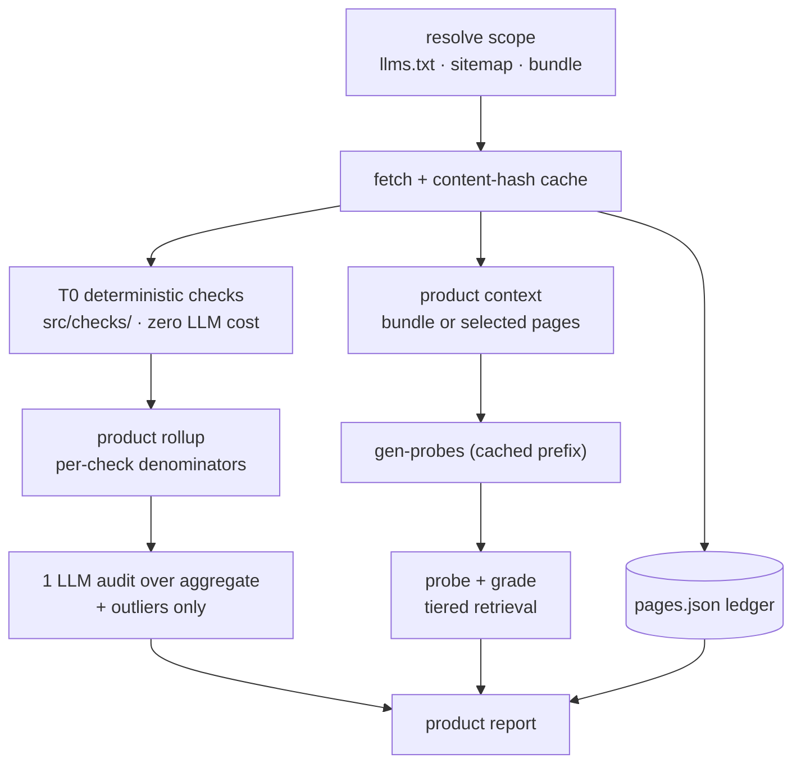

# feat: product-scoped GEO audits and probes

**Type:** enhancement
**Created:** 2026-09-10
**Status:** Phases 1–2 IMPLEMENTED (commit `5acee5c`) · Phases 3–5 pending

> **Shipped 2026-09-16.** `geo-audit product <name> [--scope curated|full|bundle] [--list]`
> resolves, fetches, and rolls up a product with **zero LLM calls** — ACE at `--scope full` is
> 59 pages in 6.5s. Ledger at `results/products/<name>/pages.json`, rollup at `rollup.json`.
> Verified: identical scores across repeat runs; incremental re-runs report unchanged pages.
>
> **First corpus finding:** ACE fails `declared-language` on **8 of 8** evaluated pages
> (declaring Rust or TypeScript over solidity/bash/plaintext). With 3 of 4 single-page audits also
> declaring Rust, this is a site-wide generator defect.
>
> **Still pending: Phases 3–5** — the product *audit* (one LLM call over aggregates), product
> *probes*, and the dashboard view. The probe half depends on multi-model PR1's deterministic
> retrieval matcher, which is being built concurrently; the tiered `exact`/`in-scope` scoring
> layers onto that matcher rather than replacing it twice.

## Overview

Raise the unit of analysis from **one page** to **one product**. Resolve a product's page set
from the site's own indexes, audit it as a corpus, and generate probes that a developer would
actually ask about *the product* rather than about a page they'd have to already know exists.

Track, for every page, whether it was discovered, fetched, included, or excluded — and why —
so both the audit and the probe run can say exactly what they looked at.

## Why the current unit is wrong

`score <url>` and `gen-probes <url>` take a single page. Three consequences:

1. **Probes are unrealistically page-shaped.** They are generated *from* one page, so they
   implicitly assume the answer lives there. A real developer asks "how do I make a CCIP token
   transfer?", not "what does `/ccip/tutorials/evm/transfer-tokens` say?"
2. **Retrieval scoring is too strict, and probably understates the tool.** `hit_expected_source`
   is an exact-URL match (`src/evaluate.js`). A model that cites a *sibling page which also
   answers correctly* is recorded as a miss. Our measured hit rates of 20–30% are, in part, an
   artifact of that definition.
3. **Cross-page defects are invisible.** The `Rust` `programmingLanguage` declaration looked like
   a one-page typo until the checks ran over four pages and found it on three. Product scope is
   where that class of finding lives.

## The site already solves discovery

Measured against `docs.chain.link` on 2026-09-10. **No crawler needs building** — the site
publishes its own product taxonomy:

- **10 per-product curated indexes** at `/{product}/llms.txt`
- **11 per-product full-text bundles** at `/{product}/llms-full.txt`
- A sitemap (`sitemap-index.xml` → `sitemap-0.xml`, 1,394 URLs) for complete coverage

| Product | Sitemap pages | Curated index | Bundle size |
|---|--:|--:|--:|
| ccip | 723 | 38 | **1.16M tok (too large)** |
| cre | 187 | 45 | — |
| data-streams | 66 | 21 | 237,760 tok |
| data-feeds | 47 | 26 | ~155k tok |
| vrf | 36 | 14 | 142,734 tok |
| ace | 34 | 14 | 60,296 tok |
| chainlink-functions | 29 | 17 | ~118k tok |
| chainlink-automation | 27 | 16 | ~75k tok |
| datalink | 21 | 12 | ~56k tok |

Two facts drive the whole design:

**The curated index is a 25–50% subset of what exists.** VRF publishes 14 curated pages out of
36; CCIP 38 out of 723. That gap is not noise — it is the difference between *"is the path the
site recommends any good?"* and *"is the product's documentation any good?"* Both are legitimate
questions and the tool should let you pick.

**The CCIP bundle does not fit in context.** At ~1.16M tokens it exceeds the 1M window, so
"just feed the bundle" cannot be the only strategy. Whatever is built must degrade to
index-plus-selection for large products.

## Scope resolution: three modes, explicitly chosen

```
geo-audit product <name> --scope curated|full|bundle
```

| Mode | Source | Answers |
|---|---|---|
| `curated` (default) | `/{product}/llms.txt` | Is the path the site points agents down any good? |
| `full` | sitemap prefix `/{product}/` | Is the whole product's documentation any good? |
| `bundle` | `/{product}/llms-full.txt` | Fastest product-level context; falls back automatically when too large |

The **curated-vs-full delta is itself a reported finding**: VRF recommending 14 of its 36 pages
means 22 pages an agent will only reach by luck. This mirrors the teammate's `llms-txt-coverage`
check (74% reachable, 10.1% linked directly) at product granularity.

## Token efficiency — the core of the design

### Audits: keep the LLM off the per-page path

Auditing 723 CCIP pages with an LLM would cost ~$217. Don't. The tiering established in
[corpus-scale-architecture.md](corpus-scale-architecture.md) applies:

1. **T0 deterministic checks on every page** — `src/checks/` already does this at **zero LLM
   cost**. Run it across the product and aggregate.
2. **One LLM call over the aggregate**, not per page. The auditor receives the product's rolled-up
   facts plus a handful of representative and outlier pages — not 723 page bodies.
3. **Per-page LLM audits only for outliers** the rollup flags.

Product audit cost becomes roughly *one* audit (~$0.30) plus a few outliers, not N audits.

### Probes: prompt caching is the whole game

Probe generation and grading both want the product context in every call. Cached, that context
is nearly free after the first request. For VRF (142,734 tokens, 10 probes):

| Strategy | Cost |
|---|--:|
| No caching — resend context per probe | **$7.14** |
| 5-min cache (1.25× write, 0.1× read) | **$1.53** |
| 1-hour cache (2× write, 0.1× read) | **$2.07** |

**A 5-minute TTL will not survive a real probe run.** Runs take ~60–75s per probe (measured in
the variance study), so 10 sequential probes exceed the window and silently re-pay full price.
Either use the 1-hour TTL or keep concurrency high enough to finish inside 5 minutes. Verify
with `cache_read_input_tokens`, which requires the usage instrumentation from
[cost-and-instrumentation.md](cost-and-instrumentation.md) — **land that first or this number is
unfalsifiable**.

### Bundle-fit strategy

```
bundleTokens = countTokens(bundle)
if (bundleTokens < CONTEXT_BUDGET)   use the bundle, one cached prefix
else                                 use curated index + select pages until budget
```

`CONTEXT_BUDGET` well under 1M (leaving room for probes, answers, and grading). CCIP takes the
second branch by construction; every other product takes the first.

## Retrieval scoring, corrected

Product scope fixes the exact-URL problem. Redefine the retrieval outcome as a **tier**, not a
boolean:

| Tier | Meaning |
|---|---|
| `exact` | Cited the page the answer key drew from |
| `in-scope` | Cited a different page inside the product that also supports the answer |
| `out-of-scope` | Cited only pages outside the product |
| `none` | Cited nothing |

Keep `exact` reported so existing runs stay comparable.

> **⚠️ Measured 2026-09-17 — the predicted correction does not occur.** Tiering was built and run
> against both existing probe sets (20 probes, CRE product scope of 265 pages). Result:
> **`in-scope` = 0/20.** Strict and tiered rates are identical at 30%. The hypothesis that
> exact-URL matching understates retrieval by scoring sibling citations as misses is **not
> supported** on this data.
>
> The reason is more interesting than the correction would have been: **retrieval failure here is
> total, not partial.** 14 of 20 answers contain no URL of any kind — not a wrong page, not an
> out-of-scope page, *nothing*. The model answers from parametric memory without pointing at any
> source. Verified independently: exactly those 14 answers have zero URLs or bare domains, and the
> 6 that do are the 6 exact hits.
>
> The tiering code is kept — it is correct, costs nothing, and will matter for product-scoped
> probes whose answer key legitimately spans several pages. But the claim that it corrects an
> understatement is retracted, and `exact` remains the headline rate.

## Provenance: what was looked at, and what was skipped

Both artifacts carry a page ledger. This is the "track which pages were crawled and decided on"
requirement, and it is also what makes the denominators honest.

```jsonc
// results/products/<product>/pages.json
{
  "product": "vrf",
  "scope": "curated",
  "resolvedAt": "2026-09-10T...",
  "sources": { "index": ".../vrf/llms.txt", "sitemapPrefix": "/vrf/" },
  "counts": { "discovered": 36, "inScope": 14, "fetched": 14, "audited": 14, "excluded": 22 },
  "pages": [
    { "url": "...", "source": "llms.txt", "status": 200, "included": true,  "contentHash": "..." },
    { "url": "...", "source": "sitemap",  "status": 200, "included": false, "reason": "not-in-curated-index" },
    { "url": "...", "source": "sitemap",  "status": 404, "included": false, "reason": "fetch-failed" }
  ]
}
```

Every count in the report cites this ledger. Following the teammate's per-check denominator rule,
a check reports `evaluatedPages` — pages it could actually assess — so a page it could not read
never counts as a failure.

Probe results gain the same treatment: which pages were in the generation context, which the
answer key drew from, and which the model cited.

## CLI surface

```sh
geo-audit product vrf                          # curated scope, audit + rollup
geo-audit product ccip --scope full            # every sitemap page under /ccip/
geo-audit product ace --probes -n 15           # product-context probes
geo-audit product vrf --list                   # resolve + print the ledger, no API calls
```

`--list` is the `--dump-content` equivalent: prove the scope resolution is right before
spending anything.

## Architecture



### New files

```
src/product/resolve.js     llms.txt / sitemap / bundle -> page list + ledger
src/product/fetch.js       polite concurrent fetch, content-hash cache
src/product/rollup.js      aggregate T0 facts, per-check denominators
src/product/context.js     bundle-fit strategy + page selection under a token budget
prompts/product-audit.md   audit prompt for aggregate facts
prompts/product-probes.md  probe generation from product context
test/product-resolve.test.js
```

Reuses unchanged: `src/checks/` (T0), `src/extract.js`, `src/evaluate.js` (grading),
`src/claude.js` (caching already wired).

## Phases

1. **Resolve + ledger.** `--list` works for all 10 products across all three scopes; no API calls.
   *Done when:* VRF resolves to 14 curated / 36 full, CCIP to 38 / 723, and the ledger explains
   every exclusion.
2. **T0 rollup.** Deterministic checks across the product with per-check denominators.
   *Done when:* the VRF rollup reports the `programmingLanguage: Rust` defect with a page count,
   and two runs on an unchanged product produce an identical rollup.
3. **Product audit.** One LLM call over aggregate facts + outliers.
   *Done when:* a VRF product audit costs roughly one page-audit and names product-wide defects.
4. **Product probes.** Bundle-or-selection context, cached prefix, tiered retrieval scoring.
   *Done when:* a 10-probe VRF run shows `cache_read_input_tokens > 0` on probes 2+ and costs
   under ~$2.50.
5. **Dashboard product view.** Rollup, ledger, and probe fidelity per product.

## Acceptance criteria

- [ ] All 10 products resolve from `/{product}/llms.txt`; `full` scope resolves from the sitemap
- [ ] `--list` prints the ledger with zero API calls
- [ ] Ledger accounts for every discovered page: included, or excluded with a reason
- [ ] Curated-vs-full delta reported as a finding (e.g. VRF 14 of 36)
- [ ] CCIP `bundle` scope detects the over-budget bundle and falls back, rather than failing
- [ ] Product audit issues **one** LLM call over aggregates, not one per page
- [ ] Probe runs verify cache reads on probes 2+; 1-hour TTL or concurrency keeps the prefix warm
- [ ] Retrieval reported as `exact` / `in-scope` / `out-of-scope` / `none`, with `exact` retained
      for comparability against existing runs
- [ ] Every check reports its own `evaluatedPages`; unassessed pages never count as failures
- [ ] Two runs on an unchanged product produce identical T0 rollups

## Risks

| Risk | Mitigation |
|---|---|
| Bundles go stale relative to live pages | Content-hash both; report drift rather than trusting the bundle |
| `in-scope` retrieval tier inflates the headline | Report `exact` alongside; label the change as a definition correction, not an improvement |
| Cache TTL expires mid-run, silently re-paying full price | Verify `cache_read_input_tokens`; needs usage instrumentation first |
| Product taxonomy is Chainlink-specific | Resolution is pluggable — `llms.txt` is a convention, sitemap-prefix is the generic fallback |
| CCIP's 723 pages make `full` scope slow | Content-hash cache + concurrency; T0 is free, so only fetch time is at stake |

## Dependencies

- **[cost-and-instrumentation.md](cost-and-instrumentation.md) Phase 1 (usage recording) should
  land first.** Every efficiency claim here — cache hit rates, the 4.7× saving, per-product cost —
  is unverifiable without it. This session already demonstrated the cost of not having it.
- [deterministic-prechecks.md](deterministic-prechecks.md) supplies T0 (built, tested, committed).
- [corpus-scale-architecture.md](corpus-scale-architecture.md) supplies the tiering rationale.

## Notes on how this plan was produced

- Research was done inline rather than via the three parallel research subagents the command
  specifies: the discovery question was answered by fetching `llms.txt` and the sitemap directly,
  which three cold agents could not have done better.
- The command template states "the current year is 2025"; the actual date is **2026-09-10**, which
  is what dates this plan and every measurement in it.
- Every figure above was measured live, not estimated — bundle sizes via `messages.count_tokens`,
  page counts from the sitemap and per-product indexes.

## References

- Per-product indexes: `https://docs.chain.link/{product}/llms.txt` (10 products)
- Per-product bundles: `https://docs.chain.link/{product}/llms-full.txt` (11 bundles)
- Sitemap: `sitemap-index.xml` → `sitemap-0.xml`, 1,394 URLs
- Exact-URL retrieval check to be replaced: `src/evaluate.js` (`hit_expected_source`)
- T0 checks: `src/checks/index.js` (`runChecks`)
- Teammate's rollup formula and denominator rule: `(passingPages + 0.5 × warnPages) / evaluatedPages`
